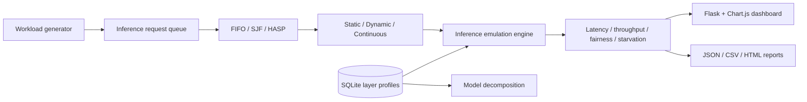
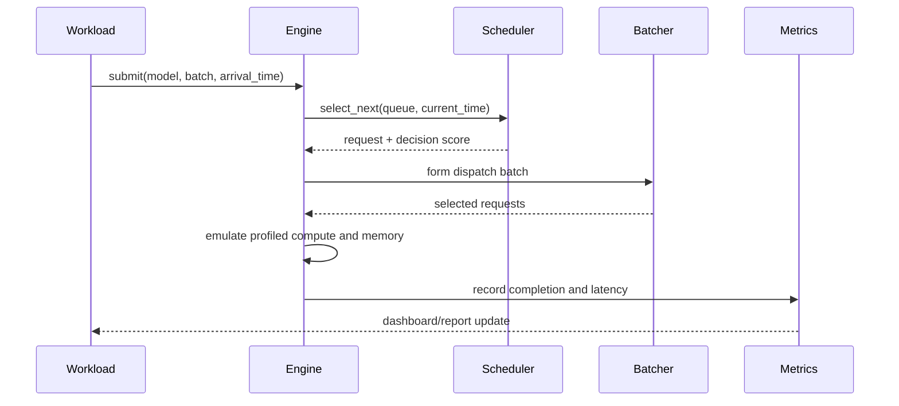

# GLIDE final-year project presentation guide

## Problem

Physical GPU access is limited, while inference serving experiments need
repeatable control over layer cost, request arrival, batching, and scheduling.
GLIDE provides a profile-driven emulator for comparing these policies.

## Architecture



## Request sequence



## HASP pseudocode

```text
for request in queue:
    compute_ms = profiled_compute(request) or estimate(request)
    memory_fit = 1.0 if memory(request) <= threshold else 0.5
    age_boost = wait_seconds(request) / aging_threshold
    score = (1 / compute_ms) * memory_fit * (1 + age_boost)
select request with maximum score
```

The aging term prevents indefinite starvation while compute and memory
affinity keep the policy competitive with SJF.

## Contributions

1. A layer-level profile database and arbitrary PyTorch model decomposition.
2. A reproducible inference queue with three batching policies.
3. HASP, combining heterogeneous affinity with aging-based priority boosting.
4. Comparative evaluation against FIFO and SJF under controlled workloads.
5. A live dashboard and machine-readable experiment reports.

## Evaluation plan

Use low, medium, and high arrival rates; mixed batch sizes; multi-model
bursty traffic; repeated seeded trials; confidence intervals; and HASP
ablations. Report average latency, P95 latency, throughput, fairness, and
starvation. The valid claim is comparative behavior under the same profile
database, not cycle-accurate physical GPU simulation.

## Limitations and viva questions

- How are missing layer profiles handled?
- Why does HASP need aging?
- When can SJF outperform HASP?
- What does Jain's Fairness Index measure?
- Why are emulated timings not identical to production-GPU timings?
- Which ablation demonstrates that each HASP component matters?
